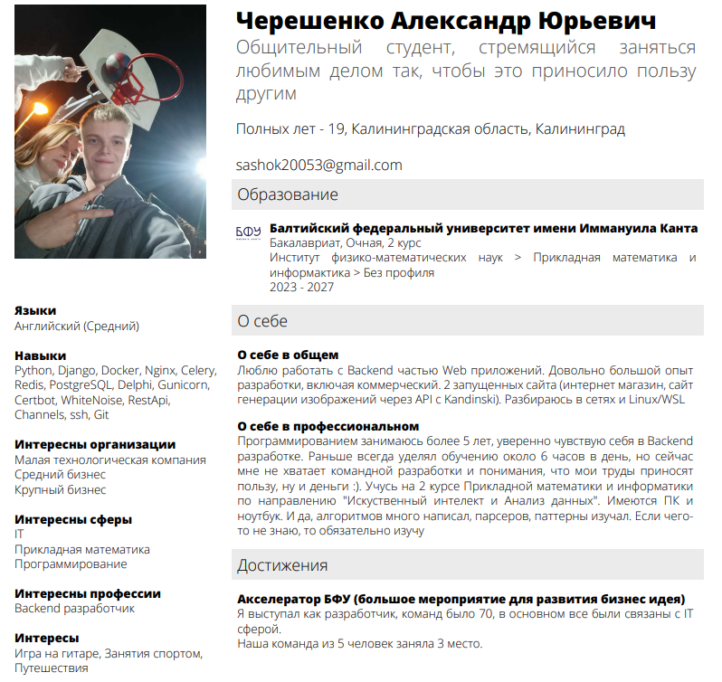

# Черешенко Александр  

---

### Моё резюме  
  

---

### 1. Почему я выбрал направление "Python-разработка"?  
Я пробовал множество сфер IT, но после создания своего первого сайта понял, что хочу стать Backend-разработчиком. Мне нравится разбираться в том, как взаимодействуют приложения, как данные отправляются, сохраняются в базу и извлекаются из неё.  

---

### 2. Опыт работы и стажировок  
- **PlaysDev** (сентябрь 2023)  
  Должность: DevOps-инженер  
  Задачи: Настройка CI/CD, деплой приложений.  
  Итог: Понял, что Backend-разработка мне интереснее, чем DevOps.  

---

### 3. Обучающие курсы  
Я прошёл множество курсов, вот ключевые:  
- **Бэкенд разработка на Django: с нуля до специалиста** (Stepik)  
- **Основы компьютерных сетей** (Stepik)  
- **Телеграм-боты на Python и AIOgram** (Stepik)  

---

### 4. Pet-проекты  
#### **FloriAI**  
- **Цель**: Помочь флористам и покупателям цветов с выбором и покупкой букетов.  
- **Реализация**: Django, Docker, REST API (Kandinsky), PostgreSQL, хостинг на Beget.  
- **Результат**: 3-е место среди 70 IT-проектов.  

#### **Fesual Store (Интернет-магазин)**  
- **Цель**: Создать полноценный интернет-магазин с нуля.  
- **Реализация**: Django, PostgreSQL, Docker, Nginx, Celery, Redis.  
- **Результат**: Успешный запуск и деплой проекта.  
 
